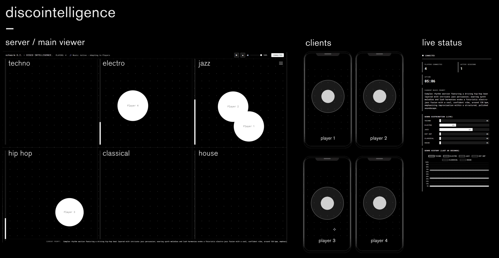

```
    ____  _                   ____      __       ______ _                            
   / __ \(_)____________     /  _/___  / /____  / / / /(_)___ ____  ____  ________  
  / / / / / ___/ ___/ __ \    / // __ \/ __/ _ \/ / / / / __ `/ _ \/ __ \/ ___/ _ \ 
 / /_/ / (__  ) /__/ /_/ /  _/ // / / / /_/  __/ / / / / /_/ /  __/ / / / /__/  __/ 
/_____/_/____/\___/\____/  /___/_/ /_/\__/\___/_/_/_/_/\__, /\___/_/ /_/\___/\___/  
                                                       /____/                         
         ♪♫•*¨*•.¸¸♪ SCHWARM D.I. ♪¸¸.•*¨*•♫♪
```

A real-time multiplayer experience where players control shapes on their smartphones, with a server view showing all players with customizable visual effects.

**A prototype for interaction with real-time generative music.**

## Screenshots



## Features

- **Mobile View** (`/`): Shows only your own ball (red) with grid background
- **Server View** (`/server-view`): Shows all players' balls (white) with connection lines and grid background
- **Stats View** (`/stats-view`): Real-time statistics and monitoring
- Real-time synchronization using Socket.IO
- Touch and mouse controls

## Local Development

1. Install dependencies:
```bash
npm install
```

2. Start the server:
```bash
npm start
```

3. Open in browser:
   - Mobile/Player view: `http://localhost:3000/`
   - Server view: `http://localhost:3000/server-view`
   - Stats view: `http://localhost:3000/stats-view`

## Deployment

### Deploy to Railway (Recommended for Socket.IO)

1. Create account at [Railway.app](https://railway.app)
2. Click "New Project" → "Deploy from GitHub repo"
3. Select this repository
4. Railway will auto-detect Node.js and deploy
5. **Port Configuration**: Railway automatically sets the PORT environment variable - no manual configuration needed! The app uses `process.env.PORT` which Railway provides automatically.
6. Your app will be live with full WebSocket support

**Note**: The server automatically uses Railway's PORT environment variable (defaults to 3000 locally). No additional configuration required!

### Other Deployment Options

For production use with real-time multiplayer, consider these platforms:
- Railway (recommended)
- Render
- Heroku
- DigitalOcean App Platform

**Note**: Avoid serverless platforms for Socket.IO applications with persistent WebSocket connections.

## Usage

1. Open the server view on a desktop/laptop to monitor all players
2. Open the mobile view on smartphones for each player
3. Drag your ball around on the mobile view
4. Watch the server view update in real-time showing all players
5. Monitor stats in real-time on the stats view

## Project Structure

- `index.html` - Mobile/player view (shows only own ball)
- `server-view.html` - Server view (shows all players)
- `stats-view.html` - Statistics and monitoring view
- `server.js` - Express + Socket.IO server
- `package.json` - Dependencies

## Technologies

- Node.js
- Express.js
- Socket.IO
- HTML5 Canvas
- Vanilla JavaScript

---

✨ *Dance with the data* ✨
